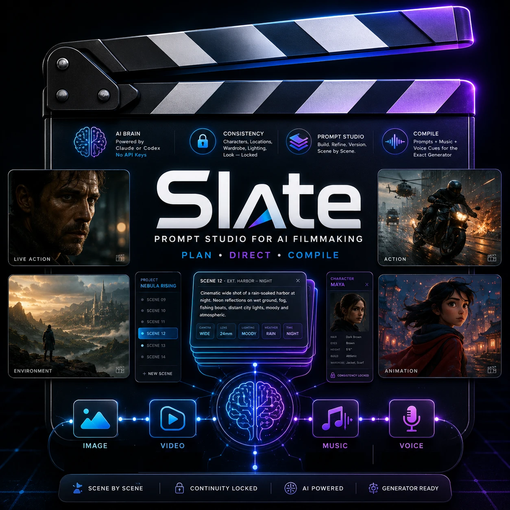

<p align="center">
  
</p>

<p align="center"><b>The prompt studio for AI filmmaking.</b><br />
Plan shots, direct coverage, spot your score, cast your voices, keep continuity — and compile production-ready prompts for any image, video, music, or voice generator.</p>

---

Slate is a desktop app for filmmakers who generate with AI. It doesn't render images or video — it makes the prompts you take *into* your generators dramatically better, faster, and consistent across an entire film.

You write (or direct) structured, sectioned shot prompts — **Subject / Composition / Lighting / Camera / Style / Mood** — with live cinematic syntax highlighting. A local AI brain helps you structure, tighten, enrich, riff, and iterate, always in the context of your project's characters, locations, props, and look.

## Highlights

- **Projects → scenes → shots.** Your film's bible (logline, world, cast, locations, props, style) travels with every prompt. Open a project and the brain already knows your protagonist's scar and your city's neon.
- **Shot specs as controls.** Length (any seconds), fps, aspect ratio, shot size, angle, lens, movement — structured fields, not prose, compiled correctly for each target model.
- **Coverage Plans.** One scene description → a full set of varied shots: Full, Dialogue, Motion, Extreme Action, Establishing, Surveillance, Entrance, Parallel Action, Dance, Angle, Orbit, Story Beats — or call your own coverage in plain English.
- **Sequence Chunks.** A 3-minute fight becomes ~20-second generation chunks with explicit continuity handoffs — each chunk's opening state matches the previous chunk's end state, with optional timecoded beats inside each chunk (`0–3s: … 4–8s: …`).
- **Director's Notes.** Talk to the shot: *"make it rain, keep the neon."* The brain updates the prompt; the old version goes to history.
- **Pickups.** Highlight one phrase, direct just that span, everything else stays put.
- **Picture Lock.** Lock any line — no transform, roll, or rewrite will ever touch it. Mute lines to keep them without exporting them.
- **Alt Takes, Variants, Punch-Ups, Tone Dial, Second Unit.** Roll chosen elements under rules, get differently-weighted versions to A/B, bold what-if riffs, systematic mood dialing, and scene extensions.
- **Casting, Art Department, Locations.** Structured sheets for characters, props/wardrobe/vehicles, and places — with natural-language auto-fill and one-click reference-sheet prompts for your image generator.
- **Lookbook.** Study a cinematographer, director, film, or series into a reusable style profile — concrete visual language, applied whole or piecemeal.
- **Sound Department.** Spot your score and cast your voices. Music cues (genre, mood, tempo, instrumentation, structure, optional lyrics — the brain can write them) compile into the right dialect for Suno, ElevenLabs Music, Lyria, and more. Voice sheets (timbre, accent, pacing, texture, emotional range — linkable to your cast) compile into voice-design prompts plus audition text for ElevenLabs and other voice tools.
- **First AD (optional).** A conversational operator: talk through what you're after, hone it together, and when the intent is clear it runs the set — creating scenes, shots, specs, prompts, characters, locations, music cues, and voices for you, with receipts for every move and full version history. Or never open it and drive everything by hand.
- **References.** Bring in stills or clips; clips are broken into key frames locally (ffmpeg) and analyzed into an element sheet — lensing, lighting, palette, composition, movement, texture — you can reuse as one-click Setups. Media is linked, never copied.
- **165+ Setups.** Film stocks, lenses, lighting rigs, composition patterns, moods — plus your own saved Setups.
- **Deliverables.** Compile any shot for a specific model — current profiles include GPT Image 2, Midjourney, Krea, Flux, Seedance, Hailuo, LTX, Kling, Sora, Veo, and ComfyUI — with per-model dialect, duration/aspect/fps preflight warnings, optional character budget (locked lines survive compression verbatim), negative prompts where supported, and timecode beats where the model honors them. Copy, or export a whole scene as a Markdown shot list or CSV.
- **Continuity Check.** A script-supervisor pass across a scene's prompts: characters, wardrobe, props, light, weather, geography.
- **Takes Log.** Circle the take that worked so the project remembers reality, not just intentions.

## The brain — your subscription, no API keys

Slate contains no API keys and makes no cloud calls of its own. It drives the AI CLIs you already have:

- **Claude Code** (recommended) — install and `claude login`
- **Codex CLI** — install and sign in

Pick the brain per project in the Project Bible. If neither CLI is installed, everything except the AI features still works.

## Install & run

Requires Node 20+ and (for clip ingestion) ffmpeg on your PATH.

```bash
git clone <repo-url> slate && cd slate
npm ci
npm run dev
```

`npm run build` + `npm start` runs the production build. Projects are saved as plain JSON under `~/Documents/Slate/` — yours to back up, sync, or version however you like.

## Working with other tools (MCP)

Slate ships a Model Context Protocol server so agents and other apps can read and write your projects while Slate runs:

```bash
claude mcp add slate -- node /absolute/path/to/slate/mcp/slate-mcp.mjs
```

Tools include `list_projects`, `list_shots`, `get_shot_prompt`, `set_shot_prompt` (with automatic versioning), `add_scene`, `list_characters`, `list_locations`, and `list_lookbook`. The control channel is localhost-only with a per-session bearer token.

## License

Apache-2.0 © Sam Wasserman
